# HITSZ-2023Summer-miniRV-CPU
> HITSZ 2023夏季学期基于miniRV 指令集的单周期和五级流水线CPU开发


```
│   data_ram.coe                               --- 提供的ram数据
│   inst_rom.coe                               --- 提供的rom指令（用于trace仿真）
│   lab1.asm                                   --- 实验一写的计算器汇编
│   
├───proj_pipeline                              --- 五级流水线文件
│   │   proj_pipeline.rar
│   │   
│   └───proj_pipeline
│       │   data_ram.coe                      
│       │   program.coe                        --- 实现多种计算功能的16进制汇编（用于上板）
│       │   proj_pipeline.xpr                  --- vivado，启动！
│       │   
│       ├───proj_pipeline.sim
│       └───proj_pipeline.srcs
│           ├───constrs_1                      --- 引脚xdc文件
│           │   └───new
│           │           miniRV_clock.xdc
│           │           miniRV_SoC.xdc
│           │           
│           ├───sim_1                          --- 上板仿真
│           │   └───new
│           │           miniRV_sim.v
│           │           
│           └───sources_1                     
│               └───new                        --- 源代码
│                       ALU.v
│                       ALUA_SEL.v
│                       ALUB_SEL.v
│                       Bridge.v
│                       BUTTON.v
│                       CONTROLLER.v
│                       defines.vh
│                       DIGITAL_LED.v
│                       EX_MEM.v
│                       HAZARD_CONTROLLER.v    --- 冒险控制器
│                       ID_EX.v
│                       IF_ID.v
│                       LED.v
│                       MEM_WB.v
│                       miniRV_SoC.v
│                       myCPU.v
│                       NPC.v
│                       PC.v
│                       RAM_SEL.v
│                       RF.V
│                       RF_WSEL.v
│                       SEXT.v
│                       SWITCH.v
│                       
└───proj_single_cycle                           --- 单周期
    │   miniRV_sim_behav.wcfg
    │   program.coe
    │   proj_single_cycle.xpr
    │   
    ├───.Xil
    │                           
    └───proj_single_cycle.srcs
        ├───constrs_1
        │   └───new
        │           miniRV_clock.xdc
        │           miniRV_SoC.xdc
        │           
        ├───sim_1
        │   └───new
        │           cpuclk_sim.v
        │           miniRV_sim.v
        │           
        └───sources_1
            ├───ip
            └───new
                    ALU.v
                    ALUB_SEL.v
                    Bridge.v
                    BUTTON.v
                    CONTROLLER.v
                    defines.vh
                    DIGITAL_LED.v
                    LED.v
                    miniRV_SoC.v
                    myCPU.v
                    NPC.v
                    PC.v
                    RF.V
                    RF_WSEL.v
                    SEXT.v
                    SWITCH.v
```                 

# 设计概述

本项目实现了and, addi, add, srl, sw, sra, lui, sll, xori, beq, lw, srai, ori, bne, bge, jal, or, jalr, srli, andi, slli, sub, blt, xor（一共24条指令）

单周期CPU频率为25MHZ（没有进一步测量）

流水线CPU频率为75MHZ

# 设计的主要特色

1. 本项目通过提前计算和前递的方式解决了数据冒险
2. 本项目通过清空寄存器和前递结合的方式解决了load-use冒险和控制冒险
3. 在解决控制冒险的过程中，采用了静态分支预测的方法

# 资源使用、功耗数据

​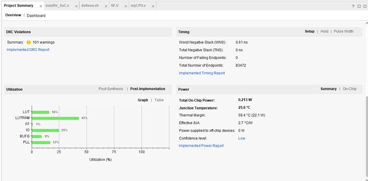

‍

​

# 1 单周期CPU设计与实现

## 1.1 单周期CPU数据通路设计

​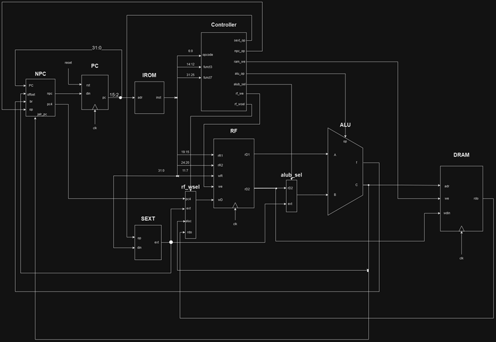​

NPC: 此模块的功能是根据当前指令选取下一条指令（next PC）的地址

‍

PC: PC模块的作用是在时钟信号的控制下像IROM发送当前指令的地址用于取指

‍

IROM：接收来自PC的指令地址pc信号，给出具体32位指令inst

‍

SEXT: 根据CONTROLLER传输来的opcode和riscv指令中的“立即数字段”生成对应的立即数

‍

CONTROLLER:得益于riscv固定的指令字段，将32位指令inst拆解传入CONTROLLER之中可以得出当前指令的各项操作是否发生，并将各标志位传出

‍

rf_wsel:四路选择器，接收来自NPC的pc4，来自SEXT的ext，来自ALU的aluc，来自DRAM的rdo信号，再根据来自Controller的rf_wsel信号选择将哪个数据写回寄存器堆RF

‍

RF：内有32个32位的寄存器组成的寄存器堆，接收inst[19:15]作为rR1，接收inst[24:20]作为rR2，接收inst[11:7]作为wR，根据rR1，rR2给出相应寄存器，可以处理写入寄存器操作或者读出操作

‍

alub_sel: 二路选择器，接收来自RF的rD2和来自SEXT的ext信号，再根据来自CONTROLLER的alub_sel信号选择将哪个数据传入ALU中

‍

ALU: 计算单元，根据从Controller传入的ALU_op操作信号对传入的A、B两个数据信号进行对应的计算操作（如加、减），输出计算结果以及标志位

‍

DRAM：接收地址addr，使能信号wen，写入的数据wdata，根据addr读出数据并以rdata输出，当wen有效时，将wdata写入到存储器中地址为addr处

## 1.2 单周期CPU模块详细设计

**PC**

​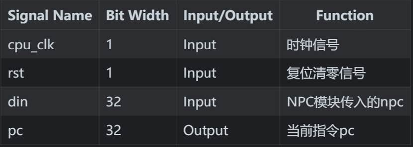​

节选核心代码：

```verilog
always @(posedge cpu_clk or posedge rst) begin

    if (rst == `RESET_EN) begin

        pc <= 32'h0000_0000;

    end

    else if (flag >= 2'b01) begin

        pc <= din;

    end

end
```

**NPC**

​​

节选核心代码：

```verilog
always @(*) begin
    if (br == `NPC_BR_DEFAULT) begin
        npc = pc;
    end

    else if (br == `NPC_BR_KEEP) begin
        npc = pc + 4;
    end

   else if (br == `NPC_BR_JUMP) begin
        if (op == `NPC_OP_OFFSET) begin
            npc = pc + offset;
        end

        else if (op == `NPC_OP_JALR) begin
            npc = jalr_pc;
        end
    end
end

```

**SEXT**

​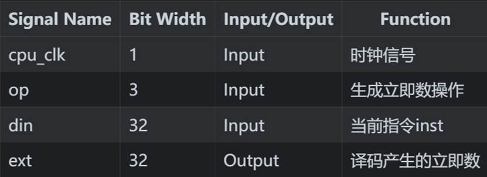​

节选核心代码：

```verilog
always @(*) begin

    case (op)

        `SEXT_OP_R: begin ext = 32'b0;                                                end

        *//`SEXT_OP_I: begin ext = {{20{din[31]}}, din[31:20]};                          end*

        `SEXT_OP_I: begin ext = $signed({din[31], din[31:20]});                          end

        `SEXT_OP_S: begin ext = {{20{din[31]}}, din[31:25], din[11:7]};               end

        `SEXT_OP_B: begin ext = $signed({din[31], din[7], din[30:25], din[11:8], 1'b0}); end

        `SEXT_OP_U: begin ext = {din[31:12], 12'b0};                                  end

        `SEXT_OP_J: begin ext = {{11{din[31]}}, din[19:12], din[20], din[30:21], 1'b0};     end

    endcase

end
```

**CONTROLLER**

​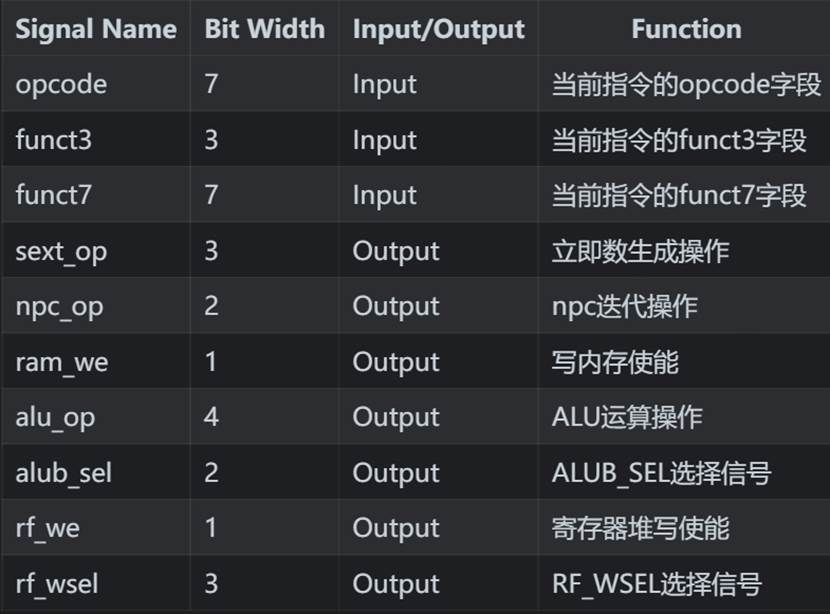​

节选核心代码：

该节选代码实现了对R型指令的译码操作

​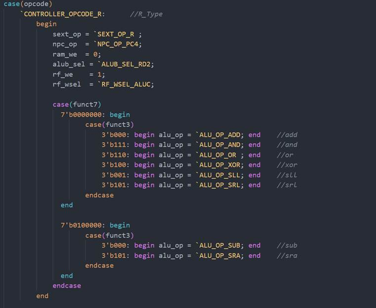​

**RF**

​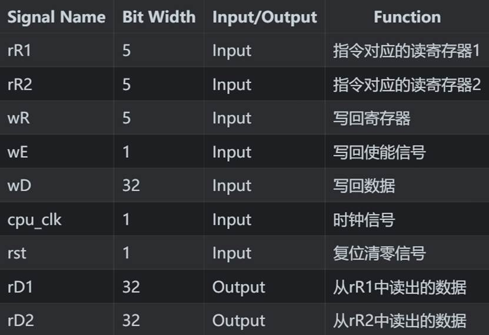​

节选核心代码：

时序写入，组合读出

```verilog
always @(*) begin

    if(rst == 1'b1) begin

        rD1 = 32'b0;

        rD2 = 32'b0;

    end

    rD1 = reg_heap[rR1];

    rD2 = reg_heap[rR2];

end

always @(posedge cpu_clk ) begin

    if ((wE == `RF_WE) && (wR != 32'b0)) begin

        reg_heap[wR] <= wD;

    end

end
```

**ALU**

​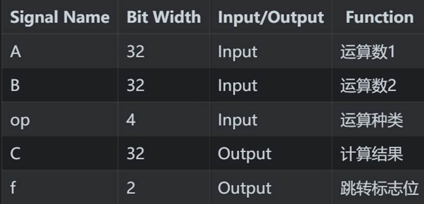​

节选核心代码：

​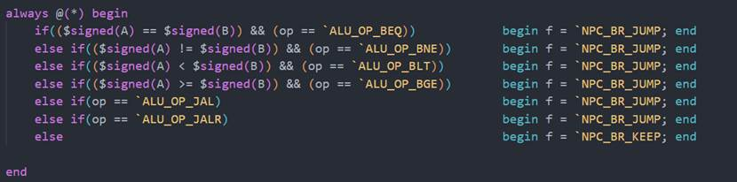​

**ALUB_SEL**

​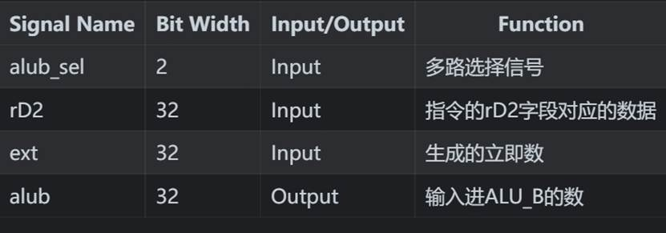​

节选核心代码：

实现了一个三路选择器

```verilog
always @(*) begin

    case(alub_sel)

        `ALUB_SEL_DEFAULT: begin alub = 32'b0; end

        `ALUB_SEL_RD2: begin alub = rD2; end

        `ALUB_SEL_EXT: begin alub = ext; end

    endcase

end
```

**RF_WSEL**

​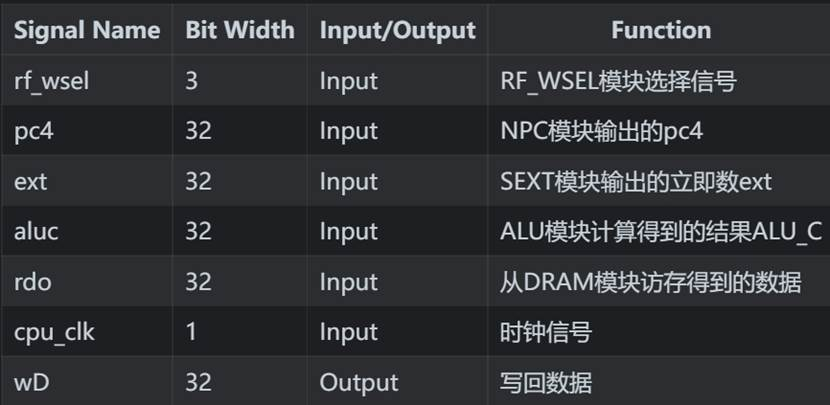​

节选核心代码：

实现了一个五路选择器

```verilog
always @(*) begin

    case (rf_wsel)

        `RF_WSEL_DEFAULT: begin wD = 32'b0; end

        `RF_WSEL_PC4:  begin wD = pc4;  end

        `RF_WSEL_EXT:  begin wD = ext;  end

        `RF_WSEL_ALUC: begin wD = aluc; end

        `RF_WSEL_RDO:  begin wD = rdo;  end

    endcase

end
```

## 1.3 单周期CPU仿真及结果分析

**逻辑运算：**

or.dump:

​`​  14:  0020e733             or  x14,x1,x2`​

​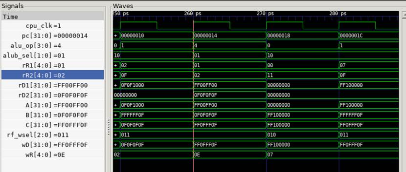​

在260ps时，pc=0x14，此时系统中进行对or指令的运算。首先经过pc寻址，pc对应的inst被传入CONTROLLER中进行译码，此时可以看到alu_op的值为4，即对应的宏定义“ALU_OP_OR”，说明ALU进行的是or操作。再看此时寄存器堆RF中，读寄存器rR1，rR2分别为对应的0x01和0x02，与汇编相符，从中读出的数据分别为0xFF00FF00，0x0F0F0F0F。此时alub_sel的值为0x01，对应的宏定义为“ALUB_SEL_RD2”，说明传入ALU_B的数据就是rD2，传入ALU_A的数据就是rD1，根据波形可知，此时A、B信号确实符合上述描述，传入ALU的数据正确。进行or操作后，ALU输出C为0XFF0FFF0F，计算正确。此时再看写回，wR与汇编一致皆为0x0E，rf_wsel=0x011，即对应宏定义的“RF_WSEL_ALUC”，将ALUC传入wR中，此时wD也与ALUC一致，运算正确。

‍

**分支跳转：**

beq.dump：

​`​   8:      00000093               addi        x1,x0,0`​

​`​   c:      00000113               addi        x2,x0,0`​

​`​  10:      00208663               beq x1,x2,1c <reset_vector+0x18>`​

​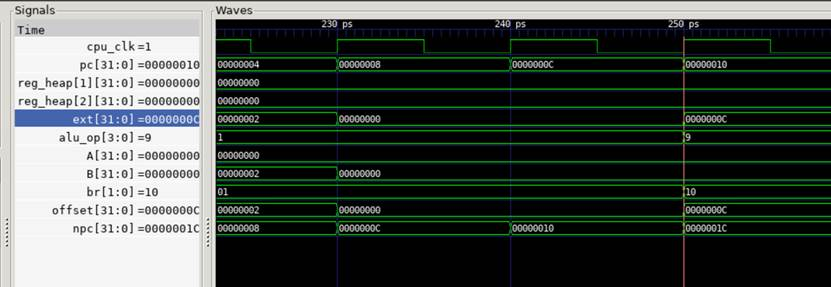​

观察波形可知，在230ps，pc=0x08时，计算得x1=0；在240ps，pc=0x0c时，计算得x2=0。再观察250ps，此时pc=0x10，正在进行beq指令。注意SEXT部件生成的立即数ext=0x0c。此时RF寄存器堆内x1，x2都为0。CONTROLLER译码传出的alu_op=0x09，对应的宏定义为”ALU_OP_BEQ”，ALU部件中根据以下代码逻辑进行beq操作：

​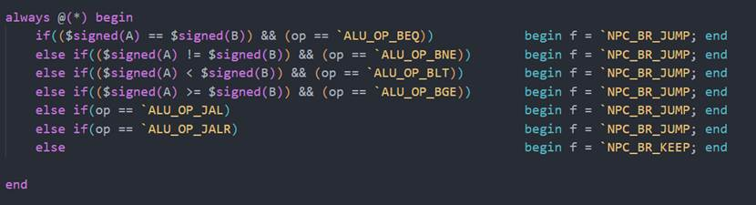​

此时再看输入ALU的参数A和B，都为0，显然二者相等，得到跳转标志位br=0x10，即宏定义”NPC_BR_JUMP”，下一条指令需要跳转。看向NPC部件内部信号，收到跳转指令之后，又因为当前指令的跳转模式是偏移量跳转，在接收到来自SEXT部件的立即数ext之后，计算出下一条分支跳转指令地址npc=pc+offset=0x10+0x0c=0x1c，与波形中npc一致，运算正确。

‍

**访存：**

lw.dump:

​`​   4:      000020b7               lui   x1,0x2`​

​`​   8:      00008093               addi        x1,x1,0 # 2000 <begin_signature>`​

​`​   c:      0000a703               lw   x14,0(x1)`​

​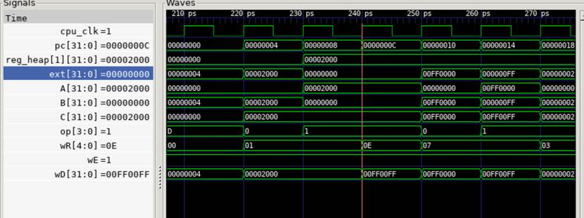​

在240ps时，此时pc=0x0c，正在处理lw操作。先看SEXT部件生成的立即数ext=0x00，与汇编相同。再看寄存器堆中的x1=0x0200。此时ALU部件的A输入为x1即0x0200，B输入为ext即0x00，来自controller部件的alu_op为0x01，即对应宏定义”ALU_OP_ADD”，ALU部件进行add操作，得到结果C=0x0200。传入DRAM部件之后写回，此时寄存器堆的wD为0x00FF00FF，写回寄存器wR为0x0E对应汇编中的x14，写回使能信号wE有效，故lw操作正确。

# 2 流水线CPU设计与实现

## 2.1 流水线CPU数据通路

​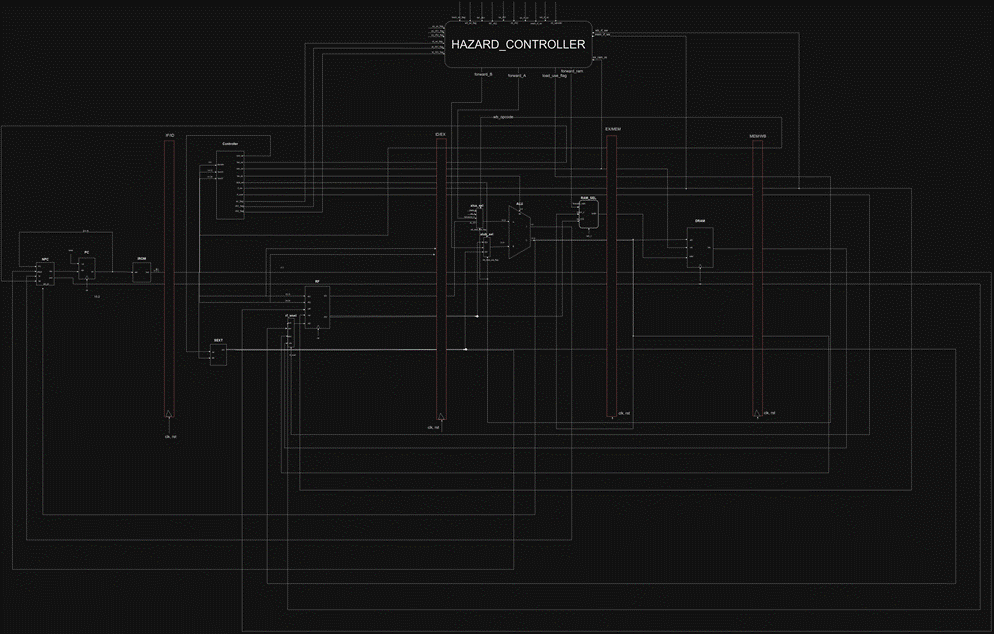​

NPC: 此模块的功能是根据当前指令选取下一条指令（next PC）的地址

PC: PC模块的作用是在时钟信号的控制下像IROM发送当前指令的地址用于取指

IROM：接收来自PC的指令地址pc信号，给出具体32位指令inst

SEXT: 根据CONTROLLER传输来的opcode和riscv指令中的“立即数字段”生成对应的立即数

CONTROLLER:得益于riscv固定的指令字段，将32位指令inst拆解传入CONTROLLER之中可以得出当前指令的各项操作是否发生，并将各标志位传出

rf_wsel:四路选择器，接收来自NPC的pc4，来自SEXT的ext，来自ALU的aluc，来自DRAM的rdo信号，再根据来自Controller的rf_wsel信号选择将哪个数据写回寄存器堆RF

RF：内有32个32位的寄存器组成的寄存器堆，接收inst[19:15]作为rR1，接收inst[24:20]作为rR2，接收inst[11:7]作为wR，根据rR1，rR2给出相应寄存器，可以处理写入寄存器操作或者读出操作

alua_sel：四路选择器，接收来自RF的rD1、来自wb阶段的rdo等信号，再根据来自HAZARD_CONTROLLER的load_use_flag等控制信号判断是否发生冒险以及选择将哪个数据传入ALU的A数据中

alub_sel: 五路选择器，接收来自RF的rD2、来自SEXT的ext、来自wb阶段的rdo等信号，再根据来自CONTROLLER的alub_sel和来自HAZARD_CONTROLLER的load_use_flag等控制信号判断是否发生冒险以及选择将哪个数据传入ALU的B数据中

ALU: 计算单元，根据从Controller传入的ALU_op操作信号对传入的A、B两个数据信号进行对应的计算操作（如加、减），输出计算结果以及标志位

DRAM：接收地址addr，使能信号wen，写入的数据wdata，根据addr读出数据并以rdata输出，当wen有效时，将wdata写入到存储器中地址为addr处

HAZARD_CONTROLLER：通过对于整个流水线中各项数据的检测，实时检测是否发生数据冒险以及load_use冒险，当冒险发生时，输出控制位信号使得流水线中其他部件能够处理冒险

RAM_SEL：三路选择器，接收来自EX/MEM寄存器的mem_c、来自ID/EX的ex_rD2、来自MEM/WB的wb_c数据信号和来自HAZARD_CONTROLLER的forward_ram信号，选择将一个信号传入DRAM模块

四个流水线寄存器：IF_ID ID_EX EX_MEM MEM_WB

由上数据通路图可以看出，总流水线被四个“红色长条状”的流水线寄存器拆分为了五个流水级，分别是IF ID EX MEM WB五个阶段

|流水级名称|流水级功能|流水级作用|
| ------------| ------------| ----------------------------------------------------------------------------------------------|
|IF|取值|获取下一条要执行的指令，主要含有NPC部件、IROM部件和PC部件|
|ID|译码|将上一时钟周期中IF阶段的取到的指令进行译码，主要含有Controller部件、SEXT部件和RF寄存器堆部件|
|EX|计算|执行上一时钟周期中ID阶段指令的运算操作，主要运算部件是ALU部件|
|MEM|访存|将EX阶段计算得到的结果写入DRAM之中，或者从DRAM中取出目标数据|
|WB|写回|将最终结果写回RF寄存器堆|

另外，冒险检测与控制模块HAZARD_CONTROLLER是独立于五个流水级的模块，通过对于五个流水级中若干数据的实时监控，可以判断当前指令是否出现冒险情况，并做出对应的反馈机制。

## 2.2 流水线CPU模块详细设计

流水线CPU与单周期CPU的主要不同在于：流水线CPU增加了HAZARD_CONTROLLER,RAM_SEL,ALUA_SEL和四个流水线寄存器部件，同时也在原有部件内增加了信号，比如说在alub_sel部件中增加了前递控制信号forward_B等

流水线寄存器的主要功能是按照时序传递流水信号，其内部功能主要是在流水线正常流转时传递不同流水级的数据，当出现冒险时停顿寄存器或者清空寄存器，内部逻辑较为简单，在此不加赘述。以下是流水线寄存器的部分代码截取

```verilog
module MEM_WB(

    input  wire clk,

    input  wire rst,

    input  wire mem_have_inst_flag,

    input  wire mem_load_use_flag,

    input  wire        mem_wr_flag ,

    input  wire        mem_rR1_flag,

    input  wire        mem_rR2_flag,

    input  wire        mem_rf_we,

    input  wire [2:0]  mem_rf_wsel,

    input  wire [4:0]  mem_rf_wr,

    input  wire [6:0]  mem_opcode,

    input  wire [31:0] mem_rdo,

    input  wire [31:0] mem_c,

    input  wire [31:0] mem_ext,

    input  wire [31:0] mem_pc4,

    input  wire [31:0] mem_pc,

    output reg         wb_have_inst_flag,

    output reg         wb_load_use_flag,

    output reg         wb_wr_flag ,

    output reg         wb_rR1_flag,

    output reg         wb_rR2_flag,

    output reg         wb_rf_we,

    output reg  [2:0]  wb_rf_wsel,

    output reg  [4:0]  wb_rf_wr,

    output reg  [6:0]  wb_opcode,

    output reg  [31:0] wb_rdo,

    output reg  [31:0] wb_c,

    output reg  [31:0] wb_ext,

    output reg  [31:0] wb_pc4,

    output reg  [31:0] wb_pc
);

always @(posedge clk or posedge rst) begin
    if (rst) begin wb_rdo <= 32'b0;        end
    else     begin wb_rdo <= mem_rdo;      end
end

always @(posedge clk or posedge rst) begin
    if (rst) begin wb_c <= 32'b0;        end
    else     begin wb_c <= mem_c;        end
end

always @(posedge clk or posedge rst) begin
    if (rst) begin wb_rf_we <= 1'b0;        end
    else     begin wb_rf_we <= mem_rf_we;        end
end

always @(posedge clk or posedge rst) begin
    if (rst) begin wb_rf_wsel <= 3'b0;        end
    else     begin wb_rf_wsel <= mem_rf_wsel;        end
end

```

其命名规范主要是“该信号所处的阶段_信号名”

**alua_sel**

​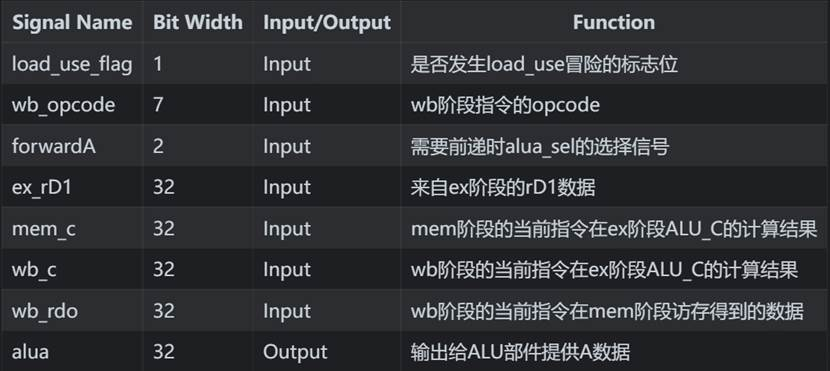​

节选核心代码：

以下代码通过判断forwardA的取值实现了应对不同冒险需要的数据前递

```verilog
always @(*) begin

    case (forwardA)

        `HAZARD_CONTROLLER_FORWARD_ID_EX  : begin alua = ex_rD1; end

        `HAZARD_CONTROLLER_FORWARD_EX_MEM : begin alua = mem_c; end

	`HAZARD_CONTROLLER_FORWARD_MEM_WB : begin 
		if (load_use_flag || (wb_opcode == `CONTROLLER_OPCODE_I_LW)) 
			begin alua = wb_rdo; end
             	else begin alua = wb_c; end
         end
        defaul: begin alua = 32'b0; end
    endcase
end
```

**alub_sel**

​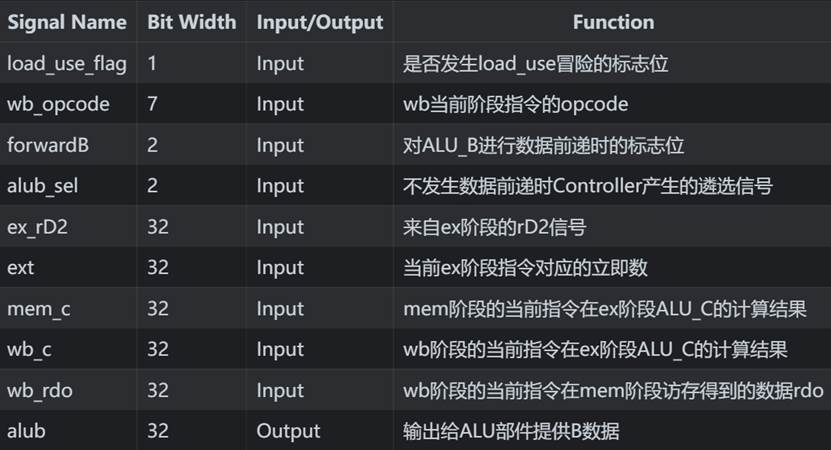​

节选核心代码：

以下代码通过判断forwardB的取值实现了应对不同冒险需要的数据前递

```verilog
always @(*) begin

    if (forwardB == `HAZARD_CONTROLLER_FORWARD_ID_EX) begin

        case(alub_sel)

            `ALUB_SEL_DEFAULT: begin alub = 32'b0; end

            `ALUB_SEL_RD2: begin alub = ex_rD2; end

            `ALUB_SEL_EXT: begin alub = ext; end

            default      : begin alub = 32'b0; end

        endcase

    end

else if (forwardB == `HAZARD_CONTROLLER_FORWARD_EX_MEM)

begin alub = mem_c; end

    else if (forwardB == `HAZARD_CONTROLLER_FORWARD_MEM_WB) begin

             if (load_use_flag || (wb_opcode == `CONTROLLER_OPCODE_I_LW))

		begin alub = wb_rdo; end

             else begin alub = wb_c; end

    end
    else  begin alub = 32'b0; end
end

```

**ram_sel**

​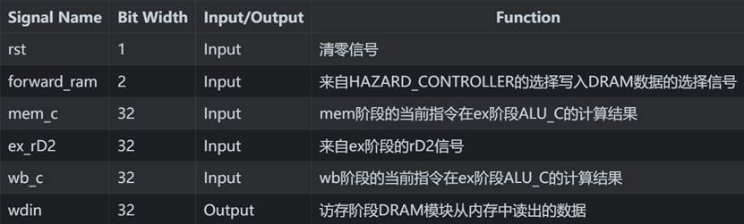​

节选核心代码：

以下代码通过判断forward_ram信号的取值实现了应对不同冒险需要的数据前递

```verilog
always @(*) begin

    if (rst) begin wdin = 32'b0; end

    else begin

        if(forward_ram == 2'b01)         begin wdin = mem_c; end

        else if (forward_ram == 2'b10)   begin wdin = wb_c;  end

        else                             begin wdin = ex_rD2; end

    end

end
```

**NPC**

​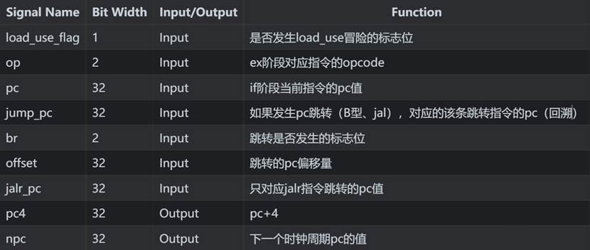​

节选核心代码：

以下代码实现了流水线pc的迭代与更新。其中pc4始终等于pc+4；当一个始终上升沿来临时，首先根据跳转标志位br判断是否发生跳转，如果没有pc跳转要求，还需进一步判断是否发生了load_use冒险，如果发生了load_use冒险，需

要停顿一个始终周期，因此有npc=pc；反之如果没有跳转也没有load_use冒险，pc = pc+4。而如果pc需要跳转时，先判断是哪种跳转方式（pc+offset偏移量跳转还是jalr的pc=reg跳转），再对npc赋值。

```verilog
always @(*) begin

    if (br == `NPC_BR_DEFAULT) begin

        npc = pc;

    end

    else if (br == `NPC_BR_KEEP) begin

        if (load_use_flag) begin npc = pc; end

        else               begin npc = pc + 4; end

    end

    else if (br == `NPC_BR_JUMP) begin

        if (op == `NPC_OP_OFFSET) begin

            npc = jump_pc + offset;

        end

        else if (op == `NPC_OP_JALR) begin

            npc = jalr_pc;

        end

        else begin npc = 32'b0; end

    end

end
```

**HAZARD_CONTOLLER**

​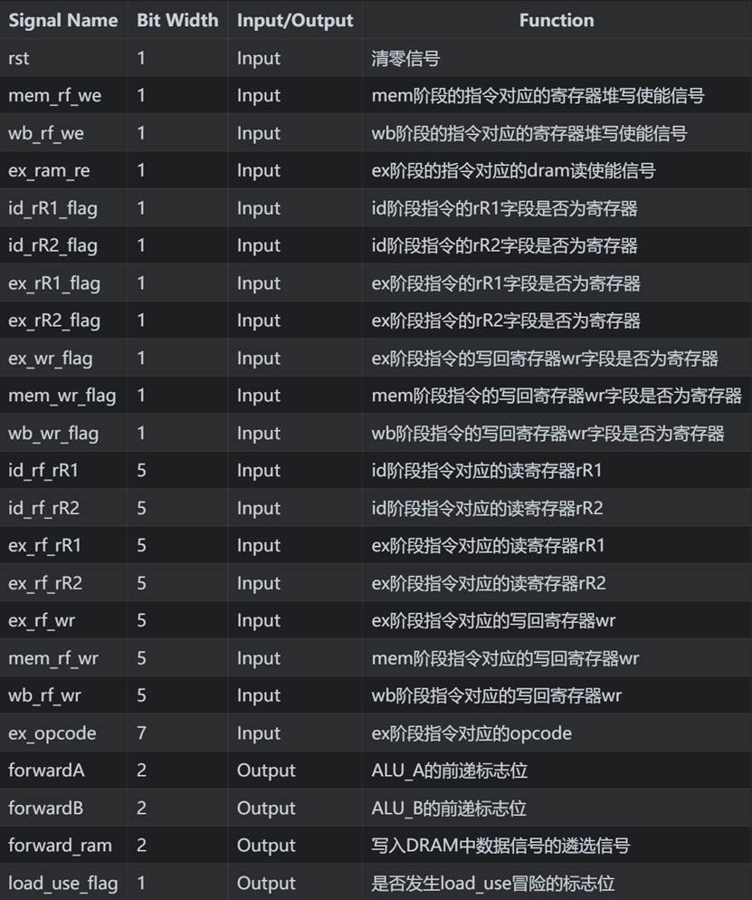​

节选核心代码：

组合逻辑，以下代码通过公式可以判断当前流水线系统中是否发生EX冒险、MEM冒险和load_use冒险，并通过对opcode等标志位的分析，可以明确将哪一个数据前递至正确的位置

​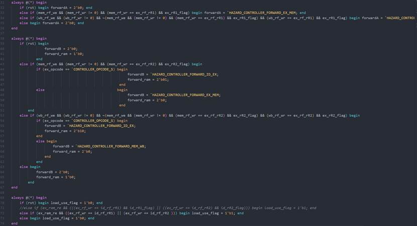​

解决数据冒险：

1. EX冒险和MEM冒险：首先在HAZARD_CONTROLLER部件中根据计组第五章PPT《流水线处理器》P58、60面的公式可以实现实时检测EX和MEM冒险的发生。当我们检测到EX或MEM冒险发生时，HAZAED_CONTROLLER输出对应的forwardA和forwardB，这两个信号可以对输入ALU的A,B信号内容进行筛选；与此同时，我们也将mem阶段和wb阶段的写回数据进行了前递，以供forward信号选择。
2. load_use冒险：load_use冒险的检测阶段同样也是根据公式检测流水线系统，不同的是，解决此类冒险不能仅仅依靠前递，还需要实现流水线的停顿。当我们检测到load_use冒险时，将flag信号从HAZARD_CONTROLLER中传入IF/ID ID/EX寄存器和NPC部件之中，在IF/ID 寄存器和NPC中实现流水线的停顿，即保持其内容不变，同时也要将ID/EX寄存器中插入空泡，不允许被写入信号。经过这样的操作后，load_use冒险转变为了MEM冒险的结构，MEM冒险机制被激活，最终解决。

解决控制冒险：

控制冒险的解决比较简单，采用的是静态预测，每次都预测本次分支不发生跳转，继续pc+4。分支结果最早在EX阶段完成确认，将标志位br传回至NPC,IF/ID,ID/EX之中。若预测错误，那么NPC中将改变npc为跳转后的PC值，IF/ID和ID/EX流水线寄存器也将被清空。

## 2.3 流水线CPU仿真及结果分析

**EX冒险：**

add.dump:

​`​  20:      00100113               addi        x2, x0, 1`​

​`​  24:      00208733               add     x14, x1, x2`​

​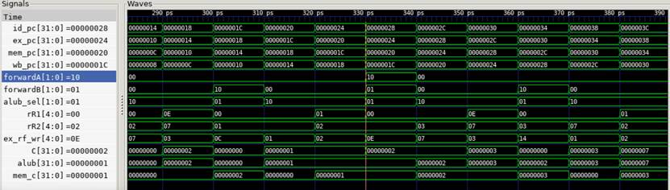​

以上两条指令之间存在EX冒险。在320ps时，此时ex_pc=0x20，说明上述第一条指令正在EX阶段计算，此时观察ALU_C=0x01，说明addi指令计算正确，但是还没有写回到ex_rf_wr=x02目标寄存器之中。再观察此时id_pc=0x24，说明add指令已经在ID译码阶段，此时寄存器堆读取寄存器rR1=0x01，rR2=0x02，可知id阶段指令的读取寄存器rR2等于ex阶段指令的写回寄存器ex_rf_wr。根据以下公式：

​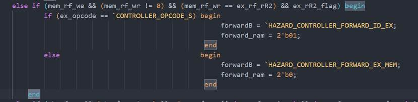​

易知此时发生了EX冒险，故在330ps的时刻，ex_pc=0x24，此时前递信号forwardB=0x01，又由于此时alub_sel=0x01，因此根据以下逻辑判定：

```verilog
else if (forwardB == `HAZARD_CONTROLLER_FORWARD_EX_MEM)

begin alub = mem_c; end
```

ALU_B应该前递来自mem阶段的ALU_C数据，在330ps时，mem_c=0x01，故此时alub也等于0x01，前递正确。

**MEM冒险：**

add.dump：

​`​  1c:      00100093               addi        x1, x0, 1`​

​`​  24:      00208733               add    x14, x1, x2`​

​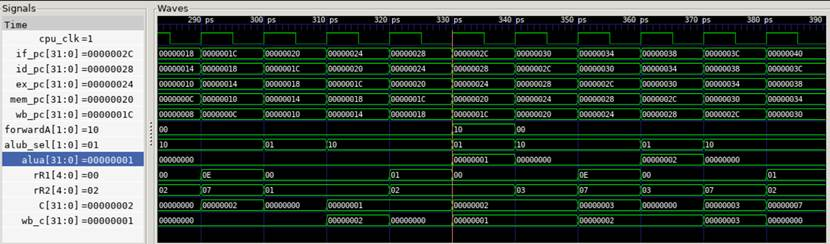​

以上两条指令之间存在MEM冒险。在300ps时，观察到id_pc=0x1c，此时id_rf_wr=01，说明pc=0x1c的指令写回寄存器0x01。在310ps时，此时ex_pc=0x1c，说明上述第一条指令addi正在EX阶段计算，此时观察ALU_C=0x01，说明addi指令计算正确，但是还没有写回到ex_rf_wr=x01目标寄存器之中。再观察320ps时。id_pc=0x24，说明add指令已经在ID译码阶段，此时寄存器堆读取寄存器rR1=0x01，rR2=0x02，可知id阶段指令的读取寄存器rR1等于wb阶段指令的写回寄存器wb_rf_wr。根据以下公式：

​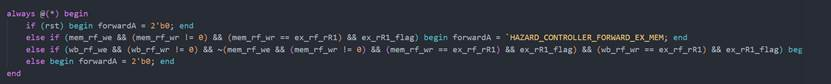​

可以知道330ps时系统判定发生了MEM冒险。forwardA=0x10，根据以下判断逻辑：

​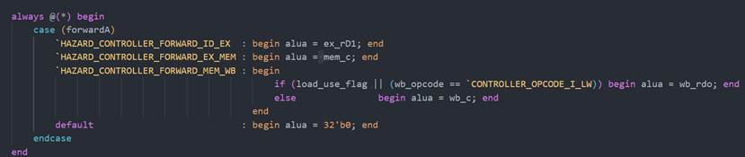​

alua应该赋值wb_c，330ps时wb_c=0x01，alua=0x01前递成功。

**控制冒险：**

beq.dump:

​`​   8:      00000093               addi        x1,x0,0`​

​`​   c:      00000113               addi        x2,x0,0`​

​`​  10:      00208663               beq        x1,x2,1c <reset_vector+0x18>`​

​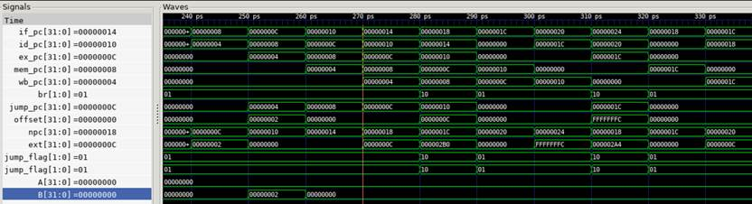​

在270ps时，id_pc=0x10，即跳转指令，可以看到，id阶段的SEXT部件已经生成对应的立即数ext=0x0C。到280ps时，跳转指令进入ex阶段，在此阶段，已

经可以判断是否预测错误，根据如下指令：

​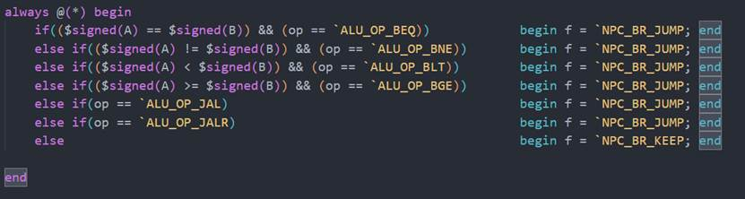​

而在280ps时，我们可以看到ALU_A=ALU_B，显然应该跳转，分支预测错误，标志位br=0x10。标志位br被传入NPC、IF/ID、ID/EX部件，同时，记录着跳转指令对应的pc值的jump_pc信号和偏移量offset信号一同传入NPC中，根据以下逻辑赋值：

```verilog
else if (br == `NPC_BR_JUMP) begin

        if (op == `NPC_OP_OFFSET) begin

            npc = jump_pc + offset;

        end

        else if (op == `NPC_OP_JALR) begin

            npc = jalr_pc;

        end

        else begin npc = 32'b0; end

    end
```

此时npc被赋值为jump_pc+offset=0x1c，是正确的分支。同时，跳转标志位传入前两个流水寄存器，对其进行清除操作。
